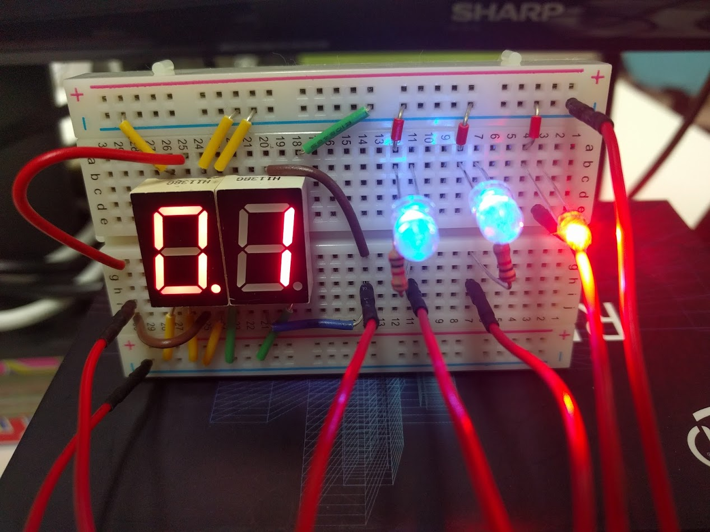

# robosys2018 LED課題

[ロボットシステム学2018第8回](https://github.com/ryuichiueda/robosys2018/blob/master/06.md)の内容より

### 動作環境

|||
|:--:|:--:|
|Raspberry Pi|Raspberry Pi Model 3B+|
|OS| Ubuntu16.04|
|kernel|Linux ubuntu 4.14.58-v7+|

Raspberry Piのimageは[齋藤篤志さんのブログ](https://www.asrobot.me/entry/2018/07/11/001603/)の「アップグレード & ROS Kinetic & カーネルコンパイル済み」を使用


## インストール手順

### デバイスドライバのインストール

デバイスドライバのコンパイルからインストールまで一括して行うbashファイル：`installDriver.sh`

```
$ git clone https://github.com/KentaKawamata/robosys2018_LEDDriver.git
$ cd robosys2018_LEDDriver
$ bash installDriver.sh
```

コマンドで行う場合
```
$ make -j1
$ sudo insmod myled.ko
$ sudo chmod  666 /dev/myled0
```

### ログの確認
```
$ sudo tail /var/log/syslog
```

### デバイスドライバのアンインストール
```
$ sudo rmmod myled
```

## LEDとPin配置

### 7セグメントLEDについて

本来は任意の数字の表示を試みていたが，持ち合わせていた7セグメントLEDがアノードコモンのものしか無かったため，  
妥協して特定の数字を点灯，消灯のみ行っている．

使用した7セグメントLED：[A-551SRD](http://akizukidenshi.com/catalog/g/gI-00639/)

### Pin配置

|GPIO|LED|
|:--:|:--:|
|7|青色左側|
|8|青色右側|
|9|7セグ「1」|
|11|赤色|
|25|7セグ「0.」|



## 実行

bashファイルで行う場合

```
$ bash runLED.sh <番号>
```
コマンドで行う場合
```
$ echo <番号> > /dev/myled0
```

|入力番号|LEDの動作|
|:--:|:--:|
|0|全消灯|
|1|「1」を点灯|
|2|「0.」と「1」点灯|
|3|「0.1」と青色1つ点灯|
|4|「0.1」と青色2つ点灯|
|5|全て点灯|

## デモ動画

https://www.youtube.com/watch?v=T-9dKwkFM8M

[](https://www.youtube.com/watch?v=T-9dKwkFM8M)
